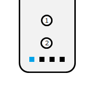

# ESP32Wiimote

ESP32Wiimote is an Arduino library for ESP32 devices, that connects over Bluetooth with a Wii remote (Wiimote), and its optional connected Nunchuk.

This fork has the following improvements:
- better output in example
- optional accelerometer read-out of Wiimote itself

On the ESP32, it reports easily at 100Hz:
- all regular button presses (A/B/C/Z/1/2/-/Home/+/D-Pad)
- the 3-dimensional acceleration/orientation of both Wiimote and Nunchuk
- the analog joystick of the Nunchuk

## Requirement

- ESP32 board (any)
- Arduino IDE (Version >= 1.8.5)
- Wii Remote (RVL-CNT-01)
- Wii Nunchuk (optional)

## Installation
1. Download the zip file.
2. Move the zip file to your libraries directory.
3. In the Arduino IDE, navigate to Sketch > Include Library > Add .ZIP Library.
4. Select the zip file.

## Examples

A full example can be found at [ESP32WiimoteDemo.ino](./examples/ESP32WiimoteDemo/ESP32WiimoteDemo.ino)

- Caution: the accelerometers report a lot of data
- This can get filtered/prevented by using 'add filter(ACTION_IGNORE,...)'
- The reports from the analog joystick of the Nunchuk can als be configured for larger minimal steps

## Usage 
No need to pair the controller over Bluetooth. Just do:
1. To connect, press the 1 and 2 buttons on Wii Remote
2. The LED1 will be on when they have finished connecting  
  

## Licence

   see [LICENSE.md](./LICENSE.md) 
